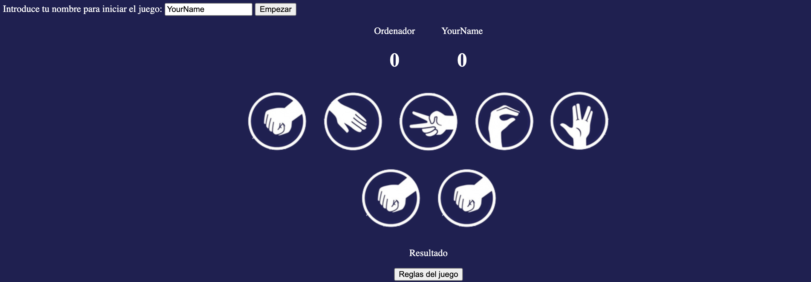

# Juego de Piedra, Papel, Tijera, Lagarto, Spock
Este repositorio contiene un juego en línea de "Piedra, Papel, Tijera, Lagarto, Spock" desarrollado con HTML, CSS y JavaScript. El juego está basado en las reglas populares de la serie de televisión "The Big Bang Theory" y ofrece una experiencia interactiva simple pero divertida.

## Características

1. Interfaz de usuario amigable.

2. Reglas del juego claramente definidas.

3. Opciones para elegir entre "Piedra," "Papel," "Tijera," "Lagarto," o "Spock."

4. Resultados visuales en función de la elección del jugador y la 5.elección del oponente.

5. Marcadores para realizar un seguimiento de las puntuaciones de jugador y oponente.

## Capturas de Pantalla

## Cómo Jugar
1. Abre el enlace del juego en tu navegador.

2. Ingresa tu nombre y haz clic en "Empezar."

3. Selecciona una de las opciones: "Piedra," "Papel," "Tijera," "Lagarto," o "Spock."

4. El ordenador también elegirá una opción.

5. El resultado del juego se mostrará en la pantalla, y se actualizarán las puntuaciones.
